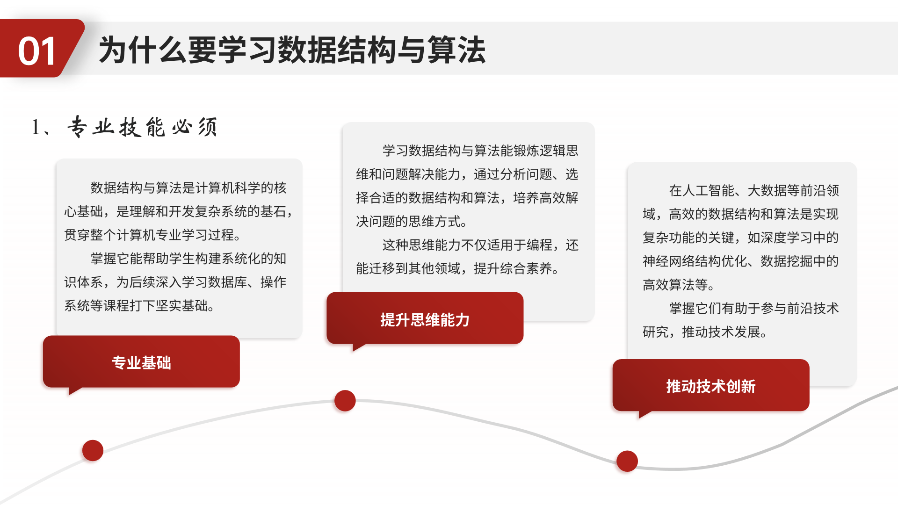
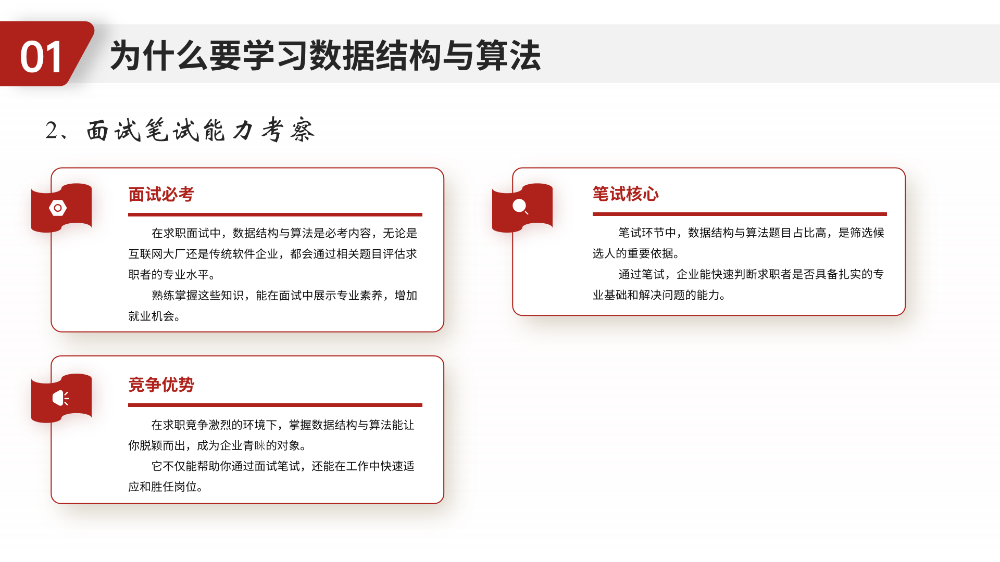
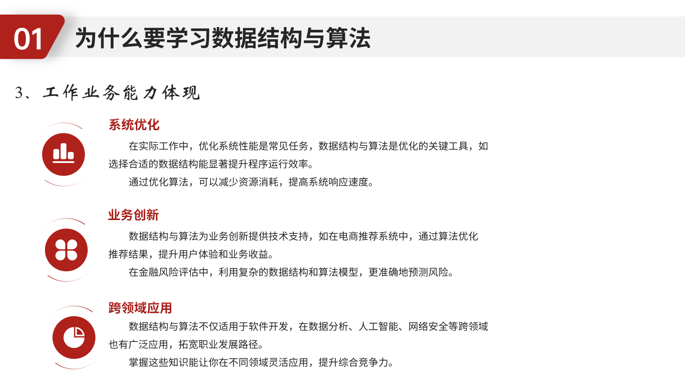

# 为什么要学习数据结构与算法

> 今天，我向大家介绍一门非常重要的课程——《数据结构与算法》。这门课不仅是计算机学科的核心，更是每一位开发者从“小白”迈向“高手”的必经之路。

## 1、为什么要学习数据结构与算法

**总的来说，数据结构与算法是：**

求职的“敲门砖”：国内外大厂面试中，70%的考题与数据结构算法相关；
能力的“分水岭”：它能区分“功能实现者”和“问题优化者”；
思维的“磨刀石”：培养抽象建模、逻辑分析与效率权衡的核心素养。

## 2、核心算法

【可视化图解+实战案例，小白也能听懂的硬核知识】

**课程讲解方式：**

核心原则是：**听得懂 、学的会 、用的上**

## 3、算法视频讲解

Python编码：https://www.bilibili.com/cheese/play/ep1509965
Java编码：https://www.bilibili.com/cheese/play/ep1510007
Golang编码：https://www.bilibili.com/cheese/play/ep1509945